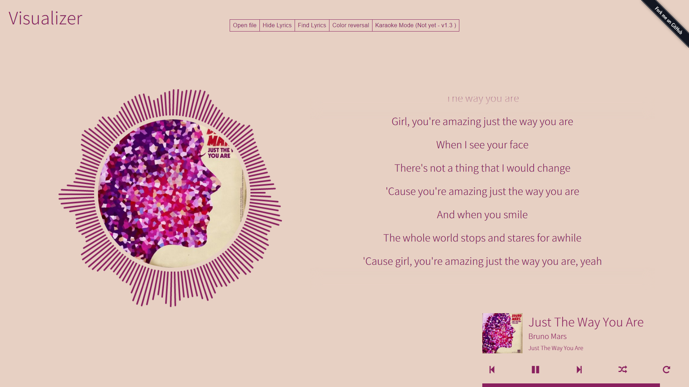
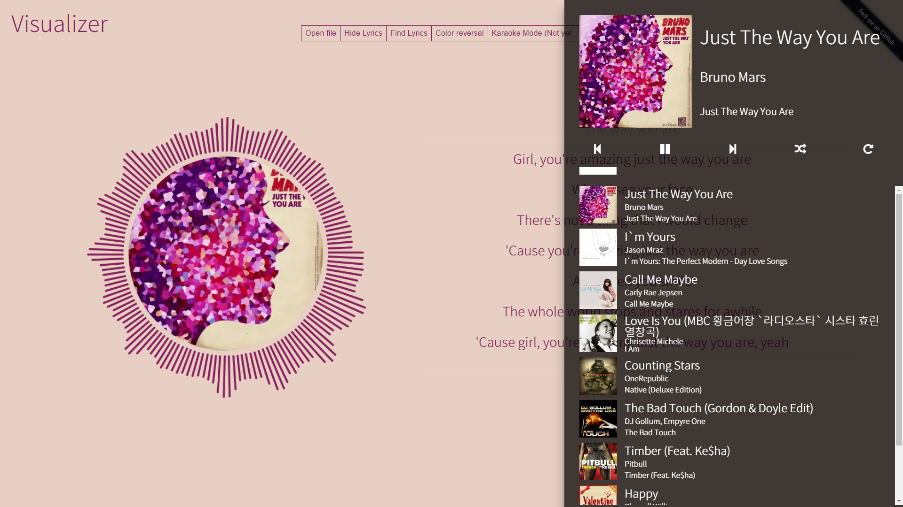

# Visualizer

##Current Version - 1.5 
### - [ChangeLog](ChangeLog.md)
(Demo) - [https://gomonk3037.github.io/Visualizer/](https://gomonk3037.github.io/Visualizer/)

## About

Music Visualizer  + Autofind Lyrics + Playlist

Made With **React**

## Used

- siiimple-toast ([github](https://github.com/gomonk3037/siiimple-Toast), [npm](https://www.npmjs.com/package/siiimple-toast))
- axios ([github](https://github.com/mzabriskie/axios), [npm](https://www.npmjs.com/package/axios))
- color-thief-standalone ([github](https://github.com/lokesh/color-thief), [npm](https://www.npmjs.com/package/color-thief-standalone)) : extract color from dataImage
- jsmediatags ([github](https://github.com/aadsm/jsmediatags), [npm](https://www.npmjs.com/package/jsmediatags))  : get ID3 tags from Audio MetaData

## Todos

- ~~ID3, colorthief JS를 이용해 오디오 파일에서 정보 추출~~
- ~~가사 파싱 : herokuapp이용해 nodejs lyrics서버 생성~~
- ~~음악 플레이리스트~~
- navigator.getUserMedia 이용 노래방 기능 구현 : 목소리 효과, MR제거, 점수매기기(??)

