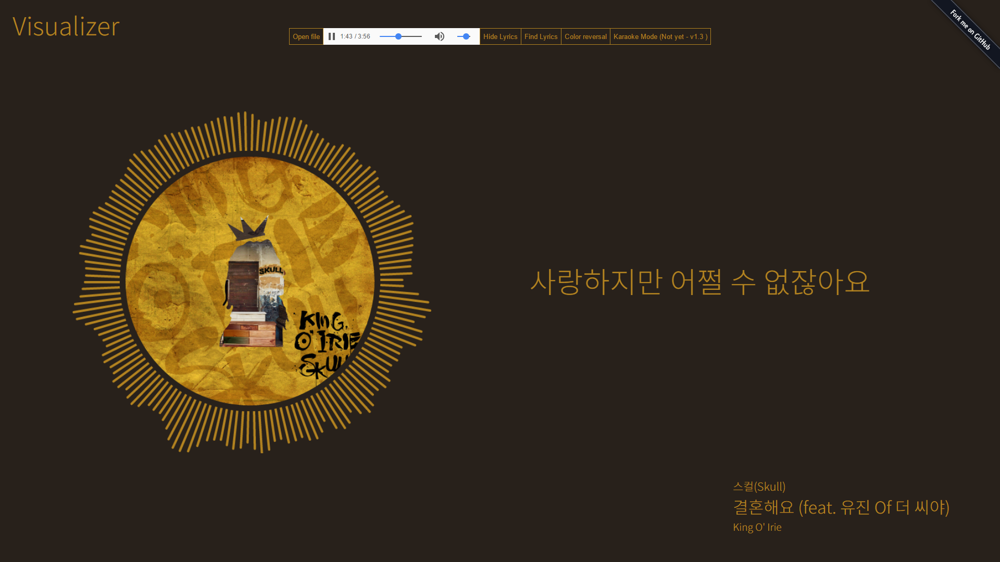

# Visualizer

##Current Version - 1.4
(Development) - [https://gomonk3037.github.io/Visualizer/](https://gomonk3037.github.io/Visualizer/)

## About

Music Visualizer  + Live Sync lyrics

made by **React**

## Todo

- ~~ID3, colorthief JS를 이용해 오디오 파일에서 정보 추출~~
- ~~가사 파싱 : herokuapp이용해 nodejs lyrics서버 생성~~
- 음악 플레이리스트
- navigator.getUserMedia 이용 노래방 기능 구현 : 목소리 효과, MR제거, 점수매기기(??)

